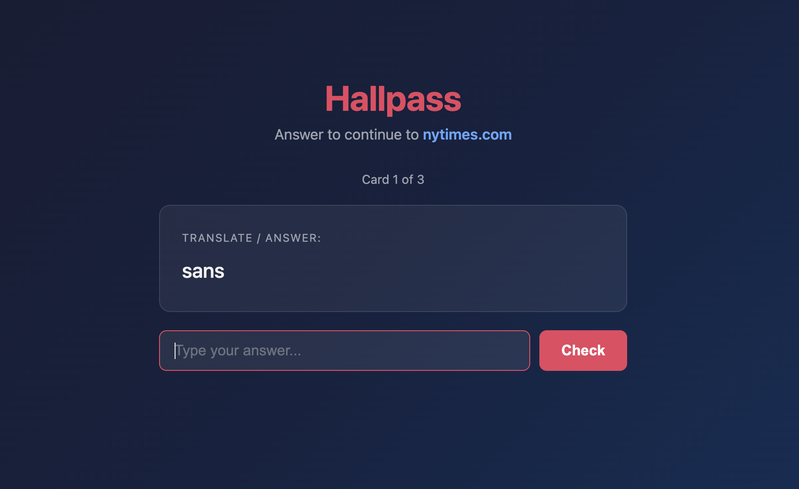
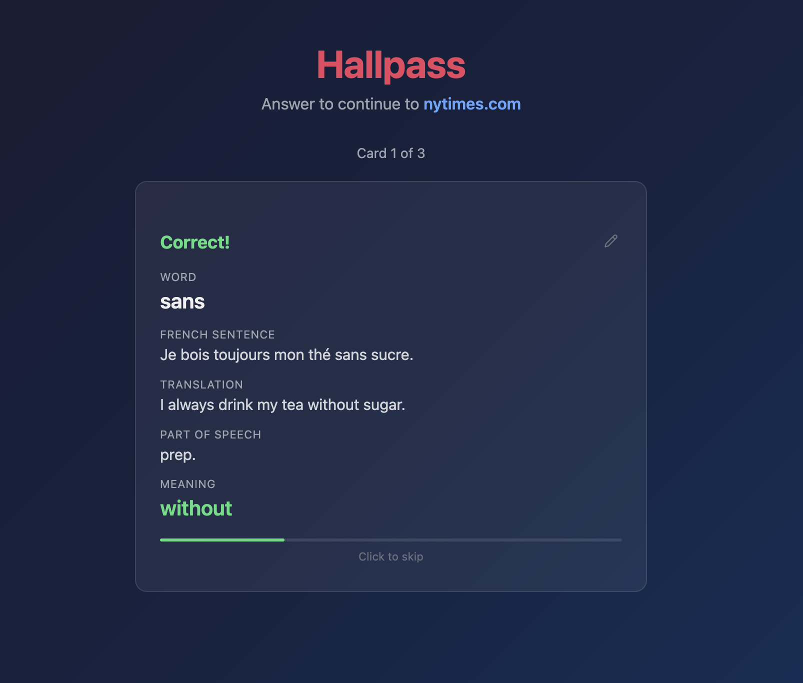
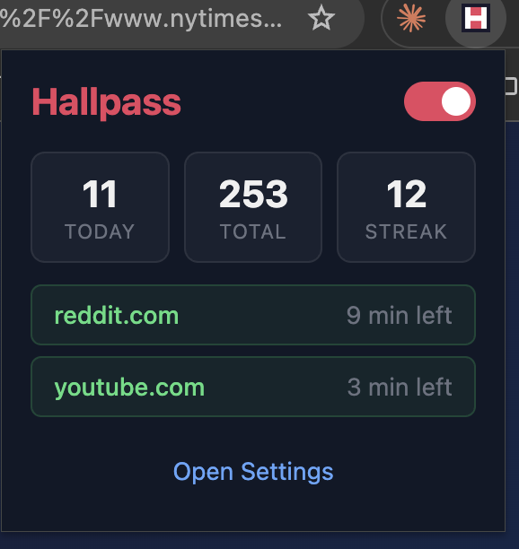
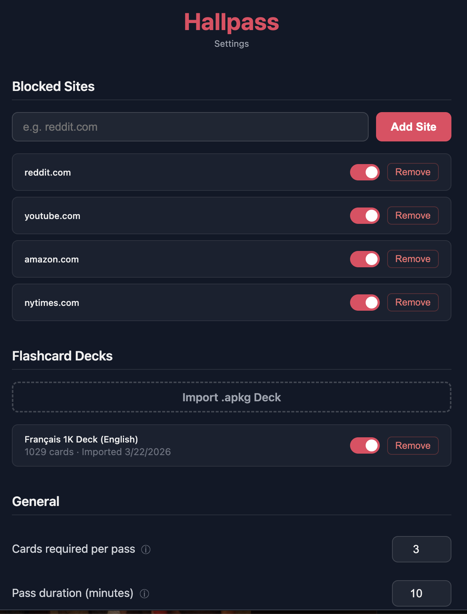

# Hallpass

**Turn your browsing habits into learning opportunities.** Hallpass is a Chrome extension that blocks access to distracting websites until you answer flashcard questions from your Anki decks — embedding spaced repetition review into your daily routine.

  
  

  
  

## What is Anki?

[Anki](https://apps.ankiweb.net/) is a free, open-source flashcard application used by millions of language learners, medical students, and anyone who needs to memorize large amounts of information. Its real power lies in its community: thousands of pre-made decks are available for free on [AnkiWeb Shared Decks](https://ankiweb.net/shared/decks), covering everything from French vocabulary to Japanese kanji to anatomy.

Hallpass piggybacks off this ecosystem. Rather than building its own flashcard format, it imports standard `.apkg` deck files directly — the same format Anki uses. This means you can download any of the thousands of free community decks and start using them with Hallpass immediately.

## How It Works

1. **Block distracting sites** — Add websites like reddit.com, youtube.com, or twitter.com to your blocked list.
2. **Answer to access** — When you navigate to a blocked site, Hallpass intercepts the request and presents flashcard questions from your imported decks.
3. **Earn a pass** — Answer the required number of cards correctly and you get temporary access to the site (configurable from 1 to 480 minutes).
4. **Review naturally** — Cards are selected using spaced repetition, so the words you struggle with appear more often, and the ones you know well fade into longer intervals.

The result: every time you reach for a distraction, you reinforce your learning instead.

## Spaced Repetition Strategy

Hallpass uses the **SM-2 algorithm**, the same algorithm that powers Anki's scheduling. Here's how it works:

**Scheduling intervals:**
- First correct answer: review again in **1 day**
- Second correct answer: review in **6 days**
- Subsequent correct answers: previous interval multiplied by the card's **easiness factor** (EF)
- Incorrect answer: interval resets to **1 day** and repetition count resets

**Easiness factor (EF):**
- Each card starts with an EF of **2.5**
- After each review, EF is adjusted based on how well you did — easy cards get higher EF (longer intervals), difficult cards get lower EF (more frequent reviews)
- EF never drops below **1.3**, ensuring even difficult cards eventually space out

**Automatic quality inference:**
Rather than asking you to self-rate (like Anki's "Again / Hard / Good / Easy" buttons), Hallpass infers review quality automatically:

| Scenario | Quality | Effect |
|---|---|---|
| Correct in under 8 seconds | 5 (perfect) | Interval grows quickly |
| Correct in 8-20 seconds | 4 (good) | Normal interval growth |
| Correct but slow (>20s) | 3 (okay) | Interval grows slowly |
| 1 wrong attempt first | 3 | Interval grows slowly |
| 2 wrong attempts first | 2 | Interval resets |
| 3+ wrong attempts | 1 | Interval resets, EF decreases |

## Setup

### Install the Extension

1. Download or clone this repository
2. Open Chrome and go to `chrome://extensions`
3. Enable **Developer mode** (toggle in the top right)
4. Click **Load unpacked** and select the Hallpass project folder

### Import a Deck

1. Download an `.apkg` deck file from [AnkiWeb Shared Decks](https://ankiweb.net/shared/decks) (or export one from the Anki desktop app)
2. Open Hallpass settings by clicking the extension icon and selecting **Open Settings**
3. Under **Flashcard Decks**, click **Import .apkg Deck** and select your file
4. If the deck has more than 2 fields, you'll be prompted to choose which field is the **question** (front) and which is the **answer** (back), with a live preview
5. Select which additional fields to display when showing the correct answer (e.g., example sentences, parts of speech)

### Configure Blocked Sites

1. In settings, under **Blocked Sites**, type a domain (e.g., `reddit.com`) and click **Add Site**
2. Toggle sites on/off individually or remove them entirely

### General Settings

- **Cards required per pass** — How many flashcards you must answer correctly before gaining access (1-10)
- **Pass duration (minutes)** — How long access lasts after answering correctly (1-480 minutes)
